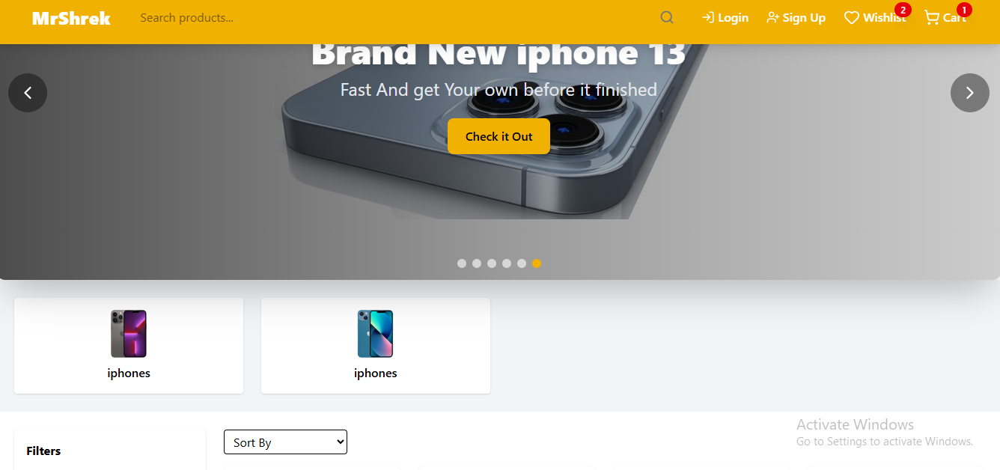
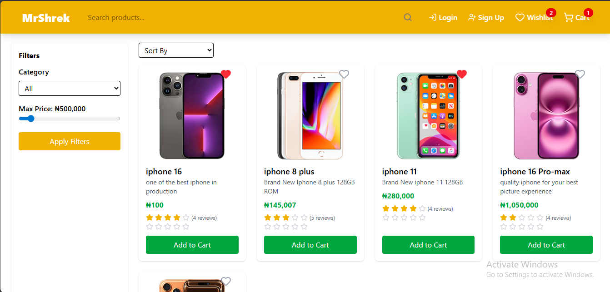
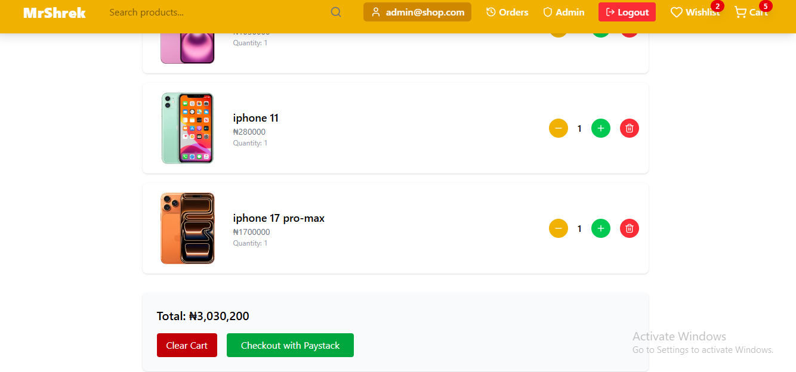
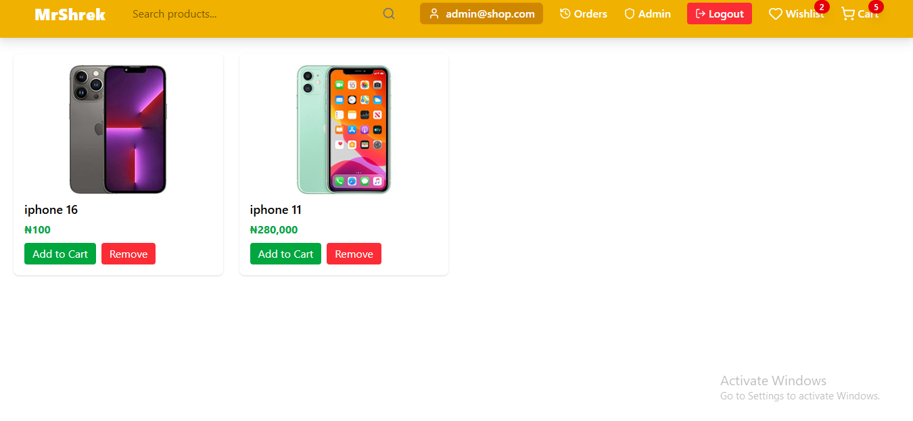
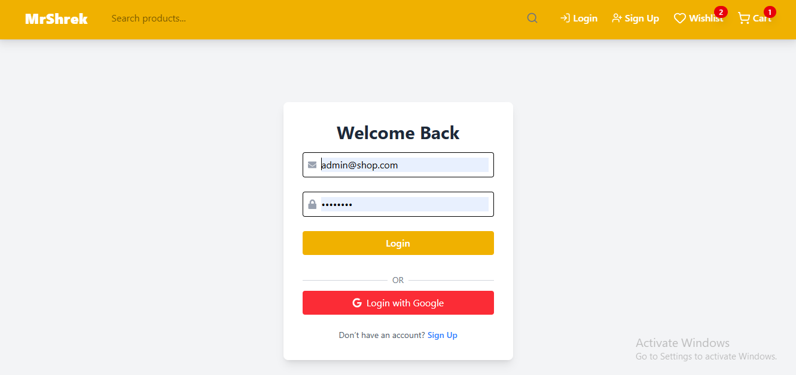

# 🛒 MrShrek Store
A responsive ecommerce store with product filters, wishlist, and authentication.

## 🔗 Live Demo
👉 [Click Here](https://mrshrek-store.vercel.app)

## 📸 Screenshots

## ⚡ Tech Stack
- React, Context API
- Tailwind CSS
- Firebase Auth + Firestore

## 🚀 Installation
git clone https://github.com/username/mrshrek-store.git
cd mrshrek-store
npm install
npm start
